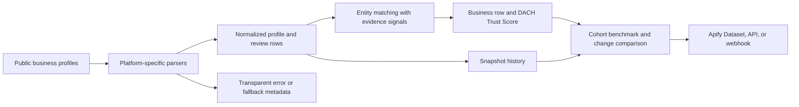

**Live Actor and maintained API: [Run ProvenExpert Reviews Scraper on Apify](https://apify.com/kamerozkan/provenexpert-reviews-scraper)**

# DACH Business Review Intelligence API Samples


Normalize public business-profile signals from ProvenExpert, Trusted Shops, eKomi, and Google Maps into profiles, business summaries, change rows, and API-ready JSON.

> **Independent and unofficial.** This project is not affiliated with, endorsed by, sponsored by, or an official integration of ProvenExpert, Trusted Shops, eKomi, or Google. Platform names identify public data sources only.

## Verified live snapshot

Audited through the public Store/API and the authenticated owner account on 2026-07-28.

| Evidence | Verified value |
|---|---|
| Store slug | `kamerozkan/provenexpert-reviews-scraper` |
| Actor ID | `B2OJoBUTuvZKhistt` |
| Visibility | Public |
| Current `latest` build | `0.3.8`, build ID `hQYPTR4urMspFJkUS`, succeeded 2026-07-28 20:29:17 UTC |
| Public Store Examples | Exactly 1 |
| Public Example | [`provenexpert-four-source-canary`](https://apify.com/kamerozkan/provenexpert-reviews-scraper/examples/provenexpert-four-source-canary), Task ID `l2U6sDRNaNRASgvVZ` |
| Private saved Tasks | 4; they are not Store Examples |
| Latest successful public Example run | `z8lykAkMmj9cVLdON`, build `0.3.5`, build ID `kfStMjrbg3e0lC17z` |
| Run window | 2026-07-28 12:27:41 UTC to 12:28:00 UTC |
| Verified dataset | `JII2EV4hr0fjTeSgR`: 7 rows, containing 3 `business` and 4 `profile` rows |
| Run result | 4 requests succeeded, 0 failed, 0 review rows, 0 error rows |

The current build is `0.3.8`, but it had no successful public Example run at audit time. The verified sample outputs below therefore come from build `0.3.5`. Current deployed input, dataset, and output schemas were compared with the audited local source and matched exactly.

## Public, private, and replay samples

| Sample | Status | What it proves |
|---|---|---|
| [`01_public_store_example_input.json`](01_public_store_example_input.json) | Public | Exact input of the only public Store Example and its successful audited run |
| [`02_private_saved_task_input.json`](02_private_saved_task_input.json) | Private, never run | Exact input of saved Task `TABYQ8XMTvX2LapLC`; it is not a public Example and had 0 runs |
| [`03_replay_delta_recipe_input.json`](03_replay_delta_recipe_input.json) | Recipe, not run | Current-schema-valid delta recipe using the audited dataset as `previousDatasetId`; replace it with a retained dataset you control |

## Decision-grade interpretation

| Buyer question | Evidence available | Required guardrail |
|---|---|---|
| What ratings and volumes are publicly reported? | Normalized `profile` rows preserve source rating and count semantics | Treat every value as a point-in-time source observation |
| Can profiles be grouped into a business? | `business` rows expose match signals and confidence | The audited canary produced 3 businesses from 4 profiles, each with `sourceCount: 1`; it did not demonstrate a four-channel merge |
| Can I guarantee known URLs belong together? | Use explicit `businesses[].id` with known platform URLs | Validate the identity and URLs before relying on the combined row |
| Can changes trigger monitoring? | Complete snapshots can produce `change` rows against history or `previousDatasetId` | A rating or review-count movement is an investigation signal, not proof of fraud or manipulation |
| Is `trustScore` an official score? | Components and `dach-trust-v1` version are returned | It is an Actor-generated composite, not a ProvenExpert or Trusted Shops score |
| Are benchmark percentiles market-wide? | Output includes basis, cohort size, and minimum cohort | Percentiles describe the observed supplied or discovered cohort only |
| Does verified mean independently authenticated? | `verificationPolicy` preserves the platform's own declaration | Source-declared or transaction labels are not independently verified by this project |

## Pipeline



## Input examples

<details>
<summary><strong>1. Public Store Example: four-source aggregate canary</strong></summary>

```json
{
  "changesOnly": false,
  "discoverExternalProfilesFromWebsite": false,
  "emitChanges": false,
  "followExternalProfiles": false,
  "includeBusinessSummary": true,
  "maxConcurrency": 4,
  "maxReviewsPerProfile": 0,
  "minimumBenchmarkCohortSize": 3,
  "outputMode": "profiles_only",
  "proxyConfiguration": {
    "useApifyProxy": false
  },
  "saveHistory": false,
  "startUrls": [
    {"url": "https://www.provenexpert.com/de-de/sp-unternehmerforum-gmbh/"},
    {"url": "https://www.trustedshops.de/bewertung/info_X898CBF73DF72E74E9BA8F9207D295CAE.html"},
    {"url": "https://www.ekomi.de/bewertungen-nomi.shop.html"},
    {"url": "https://www.google.de/maps/place/S%26P+Unternehmerforum+GmbH/@48.1779695,11.6324289,17z/data=!3m1!4b1!4m5!3m4!1s0x479e0a91689ec4ab:0xa26b4a463aacc8e!8m2!3d48.1779695!4d11.6346176?hl=de"}
  ]
}
```

Full file: [`01_public_store_example_input.json`](01_public_store_example_input.json)
</details>

<details>
<summary><strong>2. Private saved Task: collect profiles and reviews</strong></summary>

```json
{
  "changesOnly": false,
  "discoverExternalProfilesFromWebsite": false,
  "emitChanges": false,
  "followExternalProfiles": false,
  "includeBusinessSummary": true,
  "maxConcurrency": 4,
  "maxReviewsPerProfile": 50,
  "minimumBenchmarkCohortSize": 3,
  "outputMode": "profile_and_reviews",
  "proxyConfiguration": {"useApifyProxy": false},
  "saveHistory": false,
  "startUrls": [
    {"url": "https://www.provenexpert.com/de-de/sp-unternehmerforum-gmbh/"},
    {"url": "https://www.trustedshops.de/bewertung/info_X898CBF73DF72E74E9BA8F9207D295CAE.html"},
    {"url": "https://www.ekomi.de/bewertungen-nomi.shop.html"},
    {"url": "https://www.google.de/maps/place/S%26P+Unternehmerforum+GmbH/@48.1779695,11.6324289,17z/data=!3m1!4b1!4m5!3m4!1s0x479e0a91689ec4ab:0xa26b4a463aacc8e!8m2!3d48.1779695!4d11.6346176?hl=de"}
  ],
  "profileSlugs": [],
  "businesses": [],
  "searchQueries": [],
  "locale": "de-de",
  "sortBy": "newest",
  "historyDatasetName": "dach-reputation-history",
  "ratingChangeThreshold": 0.01
}
```

Full file: [`02_private_saved_task_input.json`](02_private_saved_task_input.json)
</details>

<details>
<summary><strong>3. Replay recipe: compare against the audited dataset</strong></summary>

```json
{
  "changesOnly": false,
  "emitChanges": true,
  "includeBusinessSummary": true,
  "maxReviewsPerProfile": 0,
  "outputMode": "profiles_only",
  "previousDatasetId": "JII2EV4hr0fjTeSgR",
  "saveHistory": false,
  "startUrls": [
    {"url": "https://www.provenexpert.com/de-de/sp-unternehmerforum-gmbh/"},
    {"url": "https://www.trustedshops.de/bewertung/info_X898CBF73DF72E74E9BA8F9207D295CAE.html"},
    {"url": "https://www.ekomi.de/bewertungen-nomi.shop.html"},
    {"url": "https://www.google.de/maps/place/S%26P+Unternehmerforum+GmbH/@48.1779695,11.6324289,17z/data=!3m1!4b1!4m5!3m4!1s0x479e0a91689ec4ab:0xa26b4a463aacc8e!8m2!3d48.1779695!4d11.6346176?hl=de"}
  ]
}
```

This condensed view highlights the replay fields. The complete schema-valid recipe is in [`03_replay_delta_recipe_input.json`](03_replay_delta_recipe_input.json). It was not executed as part of this audit.
</details>

## Verified and privacy-minimized outputs

Contact details, street addresses, descriptions, images, reviewer names, review text, and owner replies are omitted. See [`DATA_NOTICE.md`](DATA_NOTICE.md).

<details>
<summary><strong>1. Business summary with transparent score components</strong></summary>

```json
{
  "type": "business",
  "entityKey": "business_42817d844716bd9311e7",
  "companyName": "WENKO Online Shop",
  "sourceCount": 1,
  "platforms": {
    "trustedshops": {
      "rating": 4.69,
      "reviewCount": 4417,
      "lifetimeReviewCount": 29116,
      "verifiedReviewCount": null,
      "verificationPolicy": "platform_transaction_verified",
      "dataOrigin": "direct_profile"
    }
  },
  "trustScore": 87.2,
  "trustScoreVersion": "dach-trust-v1",
  "trustScoreComponents": {
    "ratingQuality": 92.3,
    "reviewVolume": 91.1,
    "channelCoverage": 33.3,
    "reviewFreshness": 99.5,
    "verifiedSourceShare": 100
  },
  "snapshotStatus": "complete",
  "scrapedAt": "2026-07-28T12:27:59.281Z"
}
```

Full record: [`01_verified_business_output.json`](01_verified_business_output.json)
</details>

<details>
<summary><strong>2. Trusted Shops profile aggregate</strong></summary>

```json
{
  "type": "profile",
  "platform": "trustedshops",
  "companyName": "WENKO Online Shop",
  "profileUrl": "https://www.trustedshops.de/bewertung/info_X898CBF73DF72E74E9BA8F9207D295CAE.html",
  "overallRating": 4.69,
  "ratingReviewCount": 4417,
  "lifetimeReviewCount": 29116,
  "verifiedReviewCount": null,
  "ratingDistribution": {
    "1": 126,
    "2": 40,
    "3": 117,
    "4": 522,
    "5": 3612
  },
  "isCertified": true,
  "verificationPolicy": "platform_transaction_verified",
  "scrapedAt": "2026-07-28T12:27:50.025Z"
}
```

Full record: [`02_verified_trustedshops_profile_output.json`](02_verified_trustedshops_profile_output.json)
</details>

<details>
<summary><strong>3. ProvenExpert profile aggregate</strong></summary>

```json
{
  "type": "profile",
  "platform": "provenexpert",
  "companyName": "S&P Unternehmerforum GmbH",
  "profileUrl": "https://www.provenexpert.com/de-de/sp-unternehmerforum-gmbh/",
  "overallRating": 4.64,
  "publishedReviewCount": 809,
  "ratingReviewCount": 776,
  "lifetimeReviewCount": 809,
  "verifiedReviewCount": null,
  "nativeRating": 4.63,
  "externalReviewCount": 33,
  "externalSourceCount": 4,
  "recommendationRate": 99,
  "verificationPolicy": "source_declared",
  "scrapedAt": "2026-07-28T12:27:50.335Z"
}
```

Full record: [`03_verified_provenexpert_profile_output.json`](03_verified_provenexpert_profile_output.json)
</details>

## API quick start

```bash
curl -X POST \
  "https://api.apify.com/v2/acts/kamerozkan~provenexpert-reviews-scraper/runs?token=YOUR_APIFY_TOKEN" \
  -H "Content-Type: application/json" \
  --data-binary @01_public_store_example_input.json
```

Use [`dataset_record.schema.json`](dataset_record.schema.json) to validate consumer-facing dataset records. The schema covers `business`, `profile`, `review`, `change`, and `error` row types.

## Source and interpretation limits

- The Actor reads public pages and public-facing endpoints. Markup, access controls, pagination, and field availability can change.
- Google Maps is aggregate-only in this Actor; individual Google review text is outside scope.
- Direct refresh can fail or be blocked. When a supported aggregate fallback is used, inspect `dataOrigin` and any error row.
- `maxReviewsPerProfile` is capped at 500. The audited run deliberately requested 0 and therefore proves profile aggregation, not review extraction.
- `ratingReviewCount`, `lifetimeReviewCount`, and `publishedReviewCount` describe different source concepts and must not be silently combined.
- Entity matching can be heuristic. Use an explicit business group for known cross-platform identities.
- Incomplete multi-source snapshots suppress unsafe deltas. A complete snapshot means requested grouped sources succeeded, not that every possible public review was available.
- Rating, review-volume, change, benchmark, and anomaly-style signals are prioritization aids only. They do not establish fake reviews, fraud, manipulation, wrongdoing, or authenticity.
- Retain only the data you need and confirm the legal basis, platform terms, and privacy requirements for your use case.

## License

Sample code and repository documentation are available under the [MIT License](LICENSE). Source data remains subject to its original rights, terms, and applicable law.
